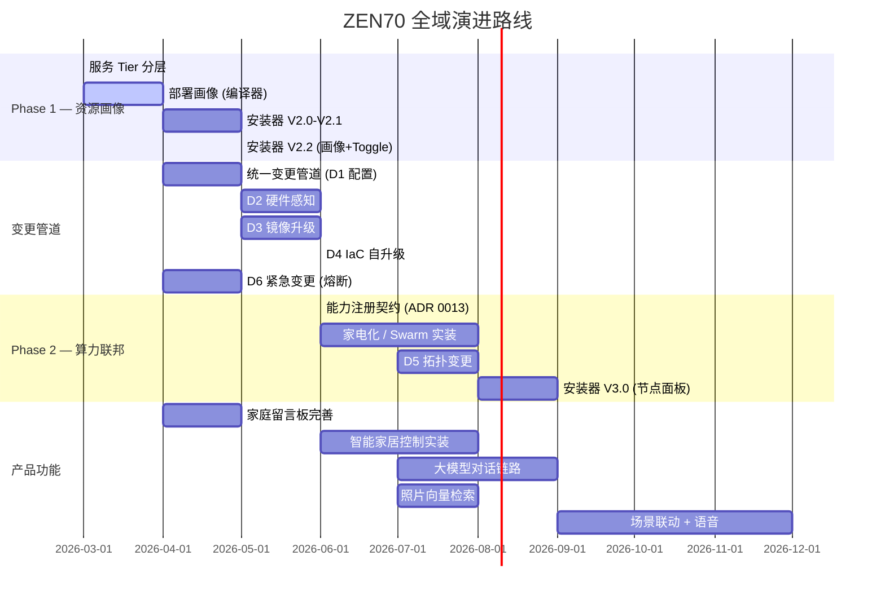

# ADR 0012: 服务分层、资源画像与算力联邦

- Status: Proposed
- Date: 2026-03-22
- Scope: 服务分层、资源画像与算力联邦

> Source of truth: code and tests override ADR text. See ADR 0052 when documentation and implementation diverge.

### 1.1 底座吞噬算力

ZEN70 当前 `system.yaml` 定义 ~20 个容器：

| 层级 | 服务 | 数量 | 估算内存 |
|--|--|--|--|
| 内核底座 | postgres, redis, gateway, caddy, pgbouncer | 5 | ~1.8 GB |
| 安全/编排 | sentinel, watchdog, docker-proxy | 3 | ~0.5 GB |
| 可观测性 | victoriametrics, grafana, loki, promtail, categraf, alertmanager, vmalert | 7 | ~2.5 GB |
| **底座合计** | | **15** | **~4.8 GB** |
| 业务功能 | jellyfin, mosquitto, cloudflared, ollama, frigate... | 5+ | 2~16 GB |

**8 GB NUC**: 底座 5 GB + 业务仅剩 3 GB → Jellyfin 勉强, Ollama/Frigate 不可能。
**4 GB 旧机**: 底座都跑不满 → 产品体验为零。

### 1.2 多节点无架构支撑

- system.yaml 只描述单机
- 编译器只生成一份 docker-compose.yml
- 安装器不知道多节点的存在
- "算力下沉"是产品亮点但零实装

### 1.3 产品功能空壳

| 模块 | 现状 | 缺失 |
|--|--|--|
| 🏠 智能家居 | 前端固定卡片 | 无设备接入/控制/添加 |
| 🤖 大模型/AI | API 接口预留 | 无实装控制链路、无语音对话 |
| 📸 照片向量 | Schema 存在 | 无实际向量检索/上传 |
| 💬 家庭留言板 | SSE 框架 | 交互体验不完整 |
| 🔌 IoT 协议 | Mosquitto 容器 | 无设备管理/自动发现 |

### 1.4 法典锚点

| 条款 | 关联 |
|--|--|
| §1.1 | docker-compose v3.8+（v3.8 = Swarm 原生格式） |
| §1.2 | 硬件以"能力标签"抽象，禁止型号硬编码 |
| §3.2 | 边缘断联→静默待命，锁 TTL 消散 |
| §3.2 | 探针写 Redis PENDING 锁，网关读取 |

---

## 2. 决策选项

### ✅ Phase 1: 部署画像（三方共识，立即实施）

在 system.yaml 引入画像，编译器按主机算力过滤服务。

```yaml
deployment:
  profile: auto     # auto | nano | lite | standard | full | custom
```

| 画像 | 最低 RAM | 启用范围 | 定位 |
|--|--|--|--|
| **nano** | 2 GB | gateway + redis + caddy + cloudflared | 极简穿透代理 |
| **lite** | 4 GB | nano + postgres + pgbouncer + sentinel | 核心可运行 |
| **standard** | 8 GB | lite + 完整 T1 监控栈 | 主力画像 |
| **full** | 16 GB+ | standard + 全部 T2 业务 | 全量部署 |
| **custom** | — | 用户 services.*.enabled 手动控 | 极客 |

服务 Tier：

| Tier | 含义 | 服务 | 可禁用 |
|--|--|--|--|
| **T0** | 不可运行的内核 | postgres, redis, gateway, caddy | ❌ |
| **T1** | 可观测与编排 | sentinel, watchdog, docker-proxy, VM, grafana, loki 等 | 画像可禁 |
| **T2** | 用户价值功能 | jellyfin, mosquitto, ollama, frigate | 可开关 |
| **T3** | 边缘/下沉 | 远端 categraf, 远端 ollama | Phase 2 |

---

### Phase 2 方向选择: 多节点算力联邦

> [!IMPORTANT]
> 原定 Phase 2（自研 Python 分发器 + 多产物编译）和 Phase 3（智能调度）**全部废弃**。
> 用以下两个工业级方案替代。

---

#### 方案 A: Docker Swarm 原生联邦

**核心洞察**: compose v3.8 本身就是为 Swarm 设计的。我们一直在用 Swarm 的声明格式，却没用 Swarm 的编排能力。

```
主控: docker swarm init
矿机: docker swarm join --token SWMTKN-xxx 192.168.1.100:2377
主控: docker node update --label-add compute.gpu=nvenc worker-1
主控: docker stack deploy -c docker-compose.yml zen70
```

**编译器改动**: 只需在 `deploy.placement.constraints` 注入能力约束：

```yaml
services:
  ollama:
    deploy:
      placement:
        constraints:
          - node.labels.compute.gpu == nvenc
  gateway:
    deploy:
      placement:
        constraints:
          - node.role == manager
```

| 维度 | 评估 |
|--|--|
| Join 机制 | 原生 `docker swarm join --token`，内置 mTLS 零配置 |
| 跨节点网络 | 原生 Overlay（加密），`http://ollama:11434` 直通 |
| IaC 统一性 | **单文件** docker-compose.yml，编译器不变 |
| 调度 | 原生 placement constraints + node labels = 能力调度 |
| 代码量 | ~100 行编译器改动 + 安装器 UI |

| 优势 | 风险 |
|--|--|
| 几万行自研代码→0 行 | Swarm 模式改变 Docker 行为（`docker compose` → `docker stack`） |
| 久经考验的 C 代码调度器 | Swarm 社区活跃度不如 K8s（但功能稳定，Docker 官方仍维护） |
| 原生服务发现和负载均衡 | 从 compose 迁移到 stack 需要验证现有流水线兼容性 |

---

#### 方案 B: 边缘算力"家电化" (Edge-as-Appliance)

**核心洞察**: 边缘节点不是"集群 worker"，而是**自治家电**——像智能灯泡一样"通电即注册、拔电即消失"。

```
主控 ← Redis pub/sub ← 边缘探针
          ↓ 能力注册
     /api/v1/capabilities 更新
          ↓
     网关动态路由
```

**流程**:

1. **边缘上线**: 节点通电 → 内置探针扫描本机能力（GPU/存储）→ 通过 WireGuard/Headscale 连入主网 → 向 Redis `capability:register` 发布 `{node_id, capabilities, endpoint}`
2. **主脑感知**: Gateway 订阅注册事件 → 更新 `/api/v1/capabilities` → 前端动态点亮对应图标
3. **请求路由**: 用户触发 AI 推理 → Gateway 查 Redis 能力表 → HTTP/gRPC 转发至边缘 `endpoint`
4. **断联降级**: 边缘拔电 → Redis TTL 30s 过期 → 能力表移除 → Gateway 503 + 前端灰化图标

**与现有架构的契合度**:

| 现有模块 | 契合点 |
|--|--|
| `sentinel` | **已经**通过 Redis 发布硬件状态 → 扩展为能力注册 |
| `switch:events` | **已有**的 Redis channel → 直接复用 |
| 网关 `/api/v1/capabilities` | **已有** JSON 矩阵 → 加入远端能力 |
| 法典 §3.2 断联降级 | **已有**规则 → TTL 过期自动执行 |

| 优势 | 风险 |
|--|--|
| 与现有 Redis sentinel 架构**天然吻合** | 跨网段通信需 VPN（WireGuard/Headscale） |
| 边缘什么技术栈都行（Docker/裸机/甚至 ESP32） | 需自研能力注册协议 |
| 主控**零改动**就能接纳新能力类型 | 无原生跨节点服务发现（需 DNS 或 IP 直连） |
| 拔电即断联，完美物理隔离 | 大流量场景（视频流）需评估网络瓶颈 |

---

## 3. 评估对比

| 维度 | Swarm 联邦 | 家电化 |
|--|--|--|
| **架构理念** | 中央集权（主控编排一切） | 联邦自治（边缘自管理） |
| **Join 成本** | 一行命令 | 一行命令 + VPN |
| **IaC 兼容** | 单 compose → stack deploy | 主控 compose 不变，边缘独立 |
| **跨节点网络** | 原生 Overlay（免费） | 需 WireGuard |
| **异构支撑** | 仅 Docker 节点 | 任何能发 HTTP 的设备 |
| **代码量** | ~100 行（编译器 + labels） | ~300 行（注册协议 + 网关路由） |
| **与现有架构契合** | 中（需 compose→stack 迁移） | **高**（复用 Redis + sentinel） |
| **法典合规** | compose v3.8 天然 Swarm | §3.2 TTL 降级天然匹配 |

---

## 4. 最终决定

**立即实施**: Phase 1 部署画像（三方共识）。

**Phase 2 多节点**: 采用 **双模融合拓扑 (Dual-Mode Topology)**。

### 4.1 统一能力契约 (Capability Contract)

无论哪种模式，所有节点共享同一能力注册契约（ADR 0013 定义）：

```
Redis Key: capability:{node_id}
TTL: 60s (心跳续期)
Value: {
  "node_id": "gpu-worker-1",
  "host": "192.168.1.200",
  "mode": "appliance" | "swarm",
  "capabilities": { "compute": { "vram_mb": 8192, "tags": ["gpu_nvenc_v1"] } },
  "services": ["ollama"],
  "endpoint": "http://192.168.1.200:11434",
  "last_heartbeat": "2026-03-22T02:14:00Z"
}
```

网关**只认契约、不管模式** — 无论节点通过 Swarm 加入还是自注册家电化加入，capability 表结构一致，路由逻辑一套代码。

### 4.2 模式选择

```yaml
# system.yaml
topology:
  mode: standalone    # standalone | appliance | swarm | hybrid
```

| 模式 | 适用场景 | 特点 |
|--|--|--|
| **standalone** | 单机部署（默认） | 无多节点，`docker compose up` |
| **appliance** | 异构设备（树莓派、ESP32、裸机） | 边缘自注册、拔电即断、零依赖 |
| **swarm** | 全 Docker 集群 | 原生 overlay 网络、placement 调度、mTLS |
| **hybrid** | 混合环境 | Swarm 管 Docker 节点 + 家电化管异构设备 |

### 4.3 双模共存架构

```
┌─ Swarm 集群 ─────────────────────────┐
│  Manager (主控)                       │
│  ├── gateway, postgres, redis...     │
│  Worker-1 (矿机, Docker)             │
│  ├── ollama (placement: gpu=nvenc)   │
│  └── capability:register → Redis     │
└──────────────────────────────────────┘
         ↕ Redis capability 契约统一
┌─ Appliance 自治区 ───────────────────┐
│  树莓派 (非 Docker, WireGuard 接入)   │
│  ├── categraf 裸机进程               │
│  └── capability:register → Redis     │
│                                       │
│  ESP32 (BLE 网关, HTTP 注册)          │
│  └── capability:register → Redis     │
└──────────────────────────────────────┘
```

Swarm worker **同时也是** capability 注册者 — 它在 Swarm 层拿到 overlay 网络，在应用层向 Redis 注册能力。两层不冲突：
- Swarm 负责**容器编排 + 网络**
- Redis 契约负责**能力发现 + 路由**

### 4.4 设计理由

1. **不二选一** — 家庭环境设备混杂（Docker 主机 + 树莓派 + IoT），单一模式覆盖不了所有场景
2. **渐进升级** — 用户从 standalone 开始 → 加几台 Docker 机器选 swarm → 再接树莓派选 hybrid
3. **统一抽象** — 网关只看 Redis 能力表，不关心节点是怎么加入的
4. **工业级基座** — Docker 节点用 Swarm 的 mTLS + overlay 不用自己造轮子；异构节点用 WireGuard + Redis 不强依赖 Docker

> [!CAUTION]
> Phase 2 实施前必须先出 ADR 0013 定义**能力注册契约 (Capability Contract)** 的 Redis schema、心跳协议、TTL 策略和降级规则。

---

## 5. 产品功能演进路线

> [!IMPORTANT]
> 以下为产品功能空壳的长期迭代清单。与基础设施分层/多节点**并行推进**。

### 5.1 近期（与 Phase 1 同期）

| 模块 | 目标 | 依赖 |
|--|--|--|
| 安装器 V2 | 三步向导 + 画像推荐 | Phase 1 画像 |
| 家庭留言板 | SSE 实时推送 + 表情/图片 + 已读状态 | 现有 SSE 框架 |

### 5.2 中期（Phase 2 同期）

| 模块 | 目标 | 依赖 |
|--|--|--|
| 智能家居控制 | 设备添加/删除 + MQTT 控制面板 + 自动发现 | Mosquitto + 前端重写 |
| 大模型实装 | Ollama 对话链路 + 语音输入（Web Speech API）+ 设备语音控 | 能力注册（Phase 2）|
| 照片向量 | 上传 → pgvector 入库 → 语义搜索 + 人脸聚类 | postgres pgvector |

### 5.3 远期

| 模块 | 目标 | 依赖 |
|--|--|--|
| 智能场景联动 | "回家模式" → 开灯 + 播音乐 + 调空调 | IoT + 大模型 |
| 算力池化 | 多 GPU 节点负载均衡推理 | Phase 2 能力路由 |
| 离线语音助手 | 本地 Whisper + 本地 LLM + TTS | 边缘 GPU 节点 |

---

## 6. 影响范围

### Phase 1 代码变更

| 模块 | 变更 |
|--|--|
| system.yaml | 新增 `deployment.profile`，服务增加 `tier` |
| iac_core/compiler | profile 过滤逻辑 (~80 行) |
| iac_core/lint.py | tier 校验 + profile 合法性 |
| policy/core.yaml | T0 不可禁用规则 |
| installer | 画像推荐 UI |
| config_version | v2 → v3 迁移 |

### Phase 2 代码变更（家电化）

| 模块 | 变更 |
|--|--|
| sentinel | 扩展能力注册协议 → Redis |
| gateway | 动态路由（按能力表转发） |
| capabilities API | 加入远端节点能力 |
| 前端 | 节点管理面板 + 能力状态 |
| ADR 0013 | 能力注册契约定义 |

### 向后兼容

- 不写 `deployment.profile` = custom（当前行为）
- 不写 `tier` = 编译器内置默认映射
- 单机模式完全不受影响

---

## 7. 图形安装器架构演进

### 7.1 当前状态与架构缺陷

现有安装器 (`installer/main.py` + `installer/index.html`) 是一个**单页表单 + SSE 日志窗**：

```
[域名] [Token] [路径] → [一键部署] → [日志滚屏]
```

| 缺陷 ID | 问题 | 法典违规 |
|--|--|--|
| **INS-1** | Token 注入越过 IaC 管道直接 patch `.env` 产物 | §1.2 唯一事实来源 |
| **INS-2** | `patch_system_yaml()` 自写 YAML 回写，绕过 `iac_core` | ADR 0011 |
| **INS-3** | 无环境预检 — Docker 未装直接报错 | 用户体验 |
| **INS-4** | 无画像/分层感知 — 弱主机盲目拉全量容器 | ADR 0012 §4.1 |
| **INS-5** | 无变更模式 — 已部署后改配置只能重走全流程 | 运维效率 |
| **INS-6** | CDN 外部依赖 (Vue/TailwindCSS/DaisyUI) — 离线无法加载 | §1.3 离线自举 |
| **INS-7** | 服务列表硬编码前端 — 无法体现 system.yaml 中的动态服务 | §1.2 协议驱动 |

### 7.2 目标架构

```
┌─────────────────────────────────────────────────────┐
│               Installer V2 (FastAPI)                │
│                                                     │
│  ┌──────────┐  ┌──────────┐  ┌───────────────────┐  │
│  │ Step 1   │  │ Step 2   │  │ Step 3            │  │
│  │ 环境检测 │→│ 参数配置 │→│ 编译 → 部署 → 检查│  │
│  └────┬─────┘  └────┬─────┘  └────────┬──────────┘  │
│       │             │                 │              │
│  /api/preflight  /api/config/*    /api/deploy (SSE)  │
│       │             │                 │              │
│  bootstrap.py   system.yaml       compiler.py        │
│  (check_*)      (ruamel回写)      (iac_core管道)     │
│                                       │              │
│                               docker compose up      │
└─────────────────────────────────────────────────────┘

所有配置流经: 用户表单 → system.yaml → iac_core → 产物
                  ↑ 唯一事实来源
```

### 7.3 分步向导设计

#### Step 1: 环境预检 (`GET /api/preflight`)

复用 `scripts/bootstrap.py` 已有函数:

| 检测项 | 函数 | 失败处理 |
|--|--|--|
| Docker 安装 | `check_docker()` | ❌ 阻断 + 安装链接 |
| Docker 版本 ≥ 20.10 | `check_docker_version()` | ❌ 阻断 |
| 端口 80/443 可用 | `check_ports()` | ❌ 提示占用程序 |
| 磁盘 ≥ 10 GB | `check_disk()` | ⚠️ 警告 |
| 主机 RAM 探测 | `psutil` / `/proc/meminfo` | → 推荐画像 |

**前端**: 逐项 ✅/❌ 动画 → 全通过亮起"下一步"。
**画像推荐**: 检测 RAM 后显示 "检测到 8 GB 内存 → 推荐 **standard** 画像"。

#### Step 2: 参数配置 (`/api/config/*`)

分三个 Tab:

**Tab 1 — 基础配置**:
- 域名 (`network.domain`) — 写入 system.yaml
- Tunnel Token — **写入 system.yaml 占位引用** `${TUNNEL_TOKEN}`，真值由编译器 `generate_secrets()` 注入 `.env`（**修复 INS-1**）
- 存储路径 (`capabilities.storage.media_path`)

**Tab 2 — 服务开关**:
- **动态读取** system.yaml 所有 services（**修复 INS-7**）
- 按 Tier 分组: T0 锁定开 / T1 按画像预选 / T2 手动
- 画像切换自动联动 toggle 状态

**Tab 3 — 硬件发现**（可选高级面板）:
- 后端扫描磁盘/GPU → 卡片展示
- 点击绑定至 `sentinel.mount_container_map`

**所有改动统一写 system.yaml → 修复 INS-2**

后端 API:
```
GET  /api/config/load    → system.yaml 当前内容 (JSON)
POST /api/config/save    → 写回 system.yaml (ruamel 保留注释)
GET  /api/config/export  → 下载配置快照 JSON
POST /api/config/import  → 上传配置快照并应用
```

#### Step 3: 编译部署 (`GET /api/deploy` → SSE)

```
[PHASE:1] system.yaml → iac_core (lint + policy + compile)
[PHASE:2] docker compose up -d --remove-orphans
[PHASE:3] 健康检查 (gateway /health, max 15 次)
[PHASE:DONE] 完成 + 跳转
```

SSE 响应头强制包含 `X-Accel-Buffering: no`（法典 §2.1）。

### 7.4 变更/重配置模式

已部署时 (`/api/status` 检测到容器运行):

```
首页 → "已部署，N 个容器运行中"
     → [修改配置] 按钮 → 直接进 Step 2
     → 改完后 → compiler --dry-run 生成 diff 预览
     → 用户确认 → docker compose up -d --remove-orphans (增量)
```

**Diff 预览** 展示:
- 🟢 新增服务
- 🔴 移除服务
- 🟡 配置变更（重建）
- ⚪ 不受影响

### 7.5 离线可用性 (修复 INS-6)

- Vue 3 / TailwindCSS / DaisyUI 打包为本地静态文件，不依赖 CDN
- 编译器模板随 `scripts/templates/` 打包发布
- 配置导入/导出支持完全离线克隆部署

### 7.6 建设阶段

| 阶段 | 内容 | 依赖 | 优先级 |
|--|--|--|--|
| **V2.0** | Step 1 环境检测 + Step 3 部署 SSE（重构现有逻辑） | 无 | 🔴 立即 |
| **V2.1** | Step 2 基础配置 Tab + IaC 合规修正（INS-1/INS-2） | iac_core | 🔴 立即 |
| **V2.2** | Step 2 服务 Toggle + 画像推荐 | Phase 1 画像 | 🟡 同期 |
| **V2.3** | 变更模式 + dry-run Diff 预览 | compiler --dry-run | 🟡 同期 |
| **V2.4** | 硬件发现 Tab + 配置导入/导出 | 无 | 🟢 后续 |
| **V2.5** | 离线打包 CDN 依赖 | 构建脚本 | 🟢 后续 |
| **V3.0** | 节点管理面板（对接 Phase 2 家电化/Swarm） | Phase 2 | 🔵 远期 |

---

## 8. 全域变更生命周期管理

> [!IMPORTANT]
> IaC 是唯一事实来源。**任何不在 system.yaml 中的状态，下次编译时必然丢失。**
> 因此所有变更（无论配置、硬件、软件、拓扑）的终点都必须是 system.yaml 的更新。

### 8.1 变更分类矩阵

| 维度 | 触发源 | 检测方式 | 影响范围 | 回滚代价 |
|--|--|--|--|--|
| **D1 配置变更** | 用户手动改设置 | 主动（设置面板） | 单/多容器重建 | 低（快照回滚） |
| **D2 硬件变更** | 物理插拔/故障 | sentinel 自动探测 | 能力矩阵 + 画像重评估 | 中（需人工确认） |
| **D3 镜像升级** | 安全补丁/版本迭代 | update.py / CVE 通知 | 容器重建 | 中（旧镜像回退） |
| **D4 IaC 管道自升级** | 编译器/模板/法典更新 | git pull / release 检测 | 全量重编译 | 高（代码回退） |
| **D5 拓扑变更** | 节点加入/移除 | 能力注册/TTL 过期 | 服务调度重分配 | 低（节点独立） |
| **D6 紧急变更** | 磁盘满/OOM/安全事件 | 探针 + 熔断 | 强制降级 | N/A（保命优先） |

### 8.2 统一变更管道

所有变更共享同一执行管道，仅**入口不同**：

```
任意变更源
    ↓
① 变更捕获 → system.yaml 更新
    ↓
② 变更锁 (Redis CHANGE_LOCK, 防并发)
    ↓
③ 快照备份 (system.yaml + docker-compose.yml + .env → backups/{timestamp}/)
    ↓
④ compiler --dry-run → 生成 diff
    ↓
┌─────────────────────────────────────┐
│  变更影响预览                       │
│  🟢 新增: ollama                    │
│  🟡 重建: gateway (镜像变更)        │
│  🔄 重启: redis (env 变更)          │
│  ⚪ 不变: postgres, caddy x6       │
│  ⏱ 预计中断: ~30s                  │
│                                     │
│  [取消]  [确认执行]  [定时执行]      │
└─────────────────────────────────────┘
    ↓ 确认
⑤ compiler (全量编译)
    ↓
⑥ docker compose up -d --remove-orphans
    ↓
⑦ 健康门控 (gateway /health, 15 次 × 3s)
    ├── ✅ 全绿 → 记录审计日志 → 完成
    └── ❌ 超时 → 自动回滚快照 → 告警
    ↓
⑧ 审计日志写入 logs/config-changes.jsonl
   {timestamp, source, changes[], diff, operator, result}
```

### 8.3 D1 — 配置变更

**入口**: 主系统设置面板 or 安装器 Step 2。

变更路径: 设置面板表单 → POST /api/config/save → system.yaml → 统一管道。

特殊处理:
- **热变更** (env-only, 如改 `AI_BACKEND_URL`): `docker compose up -d` 只 restart，不 recreate，秒级生效
- **冷变更** (镜像/卷/网络改动): 必须 recreate，有短暂中断
- 前端需区分展示："此修改可热加载" vs "此修改需要重启容器约 30 秒"

### 8.4 D2 — 硬件变更

**入口**: sentinel 自动探测 + 用户确认。

```
硬件事件 → sentinel 探测 → Redis capability:change
    ↓
网关收到事件 → 前端弹出通知
    ↓
┌──────────────────────────────────────────┐
│  🔔 检测到硬件变更                       │
│                                          │
│  ▸ 内存: 8 GB → 16 GB                   │
│    → 可升级画像: standard → full         │
│    → 可解锁: jellyfin, ollama            │
│                                          │
│  ▸ 新磁盘: /dev/sdb (2 TB, NTFS)        │
│    → 可绑定为影音存储路径                │
│                                          │
│  ▸ GPU: NVIDIA RTX 3060 (12 GB VRAM)    │
│    → 可启用: gpu_nvenc_v1 标签           │
│    → 可启用: jellyfin 硬件转码           │
│                                          │
│  [忽略]  [应用推荐配置]                  │
└──────────────────────────────────────────┘
```

"应用推荐配置" → 自动更新 system.yaml 相关字段 → 进入统一管道。

特殊场景:
- **硬件移除/故障**: sentinel 触发 §3.1 三步熔断 → 503 → 前端告警 → 不走编译管道（保命优先）
- **RAM 缩小**: 画像自动降级（full→standard），禁用超出配额的服务，要求用户确认

### 8.5 D3 — 容器镜像升级

**入口**: `scripts/update.py` 定期检查 / 用户手动触发。

三级升级策略:

| 级别 | 示例 | 策略 | 中断 |
|--|--|--|--|
| **补丁** | redis:7.2.3→7.2.4 | `docker compose pull` → restart | 秒级 |
| **小版本** | grafana:10.2→10.3 | system.yaml image 字段更新 → 编译 → recreate | 分钟级 |
| **大版本** | postgres:15→16 | system.yaml + 迁移脚本 + 数据备份 → 编译 → 蓝绿切换 | 需维护窗口 |

```
update.py 检测到新版本
    ↓
对比 system.yaml 中 image tag vs registry latest
    ↓
生成升级清单:
  redis:7-alpine         → 7.2.5-alpine (补丁, 自动)
  grafana:latest         → 10.4.1 (小版本, 需确认)
  pgvector/pgvector:pg15 → pg16 (大版本, 需迁移!)
    ↓
补丁级: 自动 pull + restart (可配置自动/手动)
小版本: 更新 system.yaml image → 统一管道
大版本: 触发专用迁移流程:
  ① Restic 全量备份
  ② PostgreSQL pg_dumpall
  ③ 更新 system.yaml image
  ④ Alembic 迁移脚本
  ⑤ 编译 + 部署
  ⑥ 健康验证
  ⑦ 失败 → 恢复备份 + 回退 image tag
```

### 8.6 D4 — IaC 管道自升级

**入口**: `git pull` 拉取新版编译器/模板/法典。

这是最危险的变更类型——编译器本身在变，旧配置可能不兼容新编译器。

```
git pull 拉取新版本
    ↓
检测变更:
  ├── scripts/iac_core/*.py    → 编译器逻辑变更
  ├── scripts/templates/*.j2   → 模板变更
  ├── iac/policy/core.yaml     → 策略规则变更
  └── config_version bump      → 需要迁移
    ↓
① config_version 不匹配 → iac_core/migrator.py 链式迁移
   (v2→v3: 添加 tier 字段, v3→v4: 添加 topology...)
    ↓
② compiler --dry-run (用新编译器编译旧配置)
    ↓
③ 展示 diff: "升级编译器后，docker-compose.yml 将产生以下变化..."
    ↓
④ 用户确认 → 全量编译 → 部署
    ↓
⑤ 失败 → git checkout 回退编译器版本 + 恢复快照
```

### 8.7 D5 — 拓扑变更

**入口**: Phase 2 看选择的方案（Swarm join / 家电化注册）。

**Swarm 模式**:
```
新节点 docker swarm join → 主控检测到 → 打标签 → 重编译 placement → stack deploy
节点下线 → Swarm 自动reschedule → 或标记 drain → 服务迁移
```

**家电化模式**:
```
新节点通电 → Redis capability:register → 网关感知 → 前端显示新能力
节点拔电 → TTL 过期 → 网关 503 降级 → 前端灰化
(主控 system.yaml 和 compose 完全不变)
```

### 8.8 D6 — 紧急变更

**入口**: 探针/监控自动触发，不经用户确认。

| 事件 | 触发 | 动作 | 法典 |
|--|--|--|--|
| 系统盘 95% | categraf/sentinel | 全局只读 + pause 高频容器 | §3.3 |
| UPS < 20% | NUT | `SHUTDOWN SAVE` 阻塞落盘 | §3.3 |
| OOM 连续 3 次 | Docker event | 自动降级画像（full→standard） | §3.1 |
| CVE 0-day | update.py | 强制拉取补丁镜像 + 自动 restart | 安全基线 |

紧急变更**绕过确认流程**，但**必须写审计日志**和**发告警通知**。恢复后由用户决定是否永久调整配置。

---

## 9. 演进总路线


