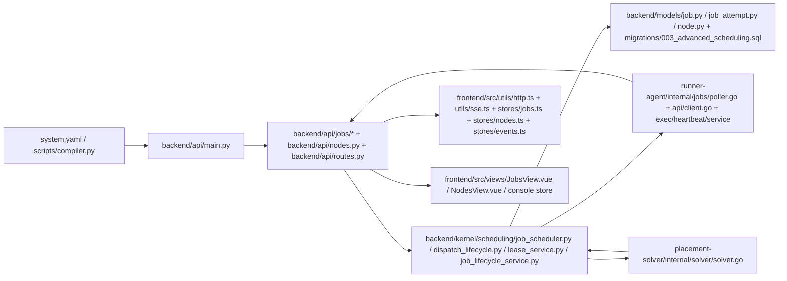

# ZEN70 执行主链深度审查报告（2026-04-07）

- `report_id`: `AUDIT-EXEC-CHAIN-2026-04-07`
- `scope`: `M1 执行主链`
- `excluded_paths`: `frontend/node_modules/**`, `frontend/dist/**`, `__pycache__/**`, `.pytest_cache/**`, `.mypy_cache/**`, `.gocache/**`
- `evidence_types`: 控制流/状态机推演、契约与模型一致性、测试与门禁交叉验证、失败场景与边界条件分析、实现与导出物偏差比对
- `gate_evidence`:
  - `python -m pytest backend/tests/unit/test_architecture_governance_gates.py tests/test_repo_hardening.py -q`
  - `python -m pytest backend/tests/unit/test_contract_capabilities.py tests/test_compliance_sre.py -q`
  - `npm --prefix frontend run test -- --reporter=dot`
  - `go test ./...` in `runner-agent`
  - `go test ./...` in `placement-solver`

## 范围说明

本报告只以当前仓库实现为事实源，按固定链路做纵深重审：

`system.yaml / scripts` 配置入口 -> `backend/api/main.py` 与 jobs/nodes/control 入口 -> `backend/core` 中调度、租约、重试、并发、配额、placement、状态流转 -> `backend/models` 与 migration -> `runner-agent` 轮询、执行、心跳、结果回传 -> `placement-solver` -> `frontend` jobs/nodes/events/console 消费与展示。

本次首报目标不是覆盖整仓，而是先证明执行主链每一跳都被点名审过，且所有发现都能落到具体文件、函数和状态转移。身份权限、连接器编排、部署/IaC、可观测性、兼容面等剩余范围已经在本批次模块化归类，见 [`module-catalog.yaml`](./module-catalog.yaml)。

## 链路图

## 审查过的路径清单

- 配置入口：`system.yaml`、`scripts/compiler.py`
- HTTP 与事件入口：`backend/api/main.py`、`backend/api/routes.py`、`backend/api/control_events.py`
- 执行 API：`backend/api/jobs/__init__.py`、`backend/api/jobs/submission.py`、`backend/api/jobs/routes.py`、`backend/api/jobs/dispatch.py`、`backend/api/jobs/lifecycle.py`、`backend/api/jobs/helpers.py`、`backend/api/jobs/database.py`、`backend/api/jobs/dlq.py`、`backend/api/jobs/models.py`
- 节点 API：`backend/api/nodes.py`、`backend/api/nodes_models.py`
- 核心状态机：`backend/kernel/scheduling/job_scheduler.py`、`backend/kernel/execution/dispatch_lifecycle.py`、`backend/kernel/execution/lease_service.py`、`backend/kernel/execution/job_lifecycle_service.py`、`backend/kernel/execution/failure_taxonomy.py`、`backend/kernel/topology/node_auth.py`、`backend/core/safe_error_projection.py`、`backend/kernel/execution/attempt_expiration_service.py`、`backend/core/redis_client.py`、`backend/kernel/scheduling/placement_solver.py`、`backend/kernel/scheduling/placement_grpc_client.py`、`backend/kernel/scheduling/quota_aware_scheduling.py`
- 数据层：`backend/models/job.py`、`backend/models/job_attempt.py`、`backend/models/node.py`、`migrations/003_advanced_scheduling.sql`
- 后台 worker：`backend/workers/attempt_expiration_worker.py`
- runner-agent：`runner-agent/internal/api/client.go`、`runner-agent/internal/jobs/poller.go`、`runner-agent/internal/exec/executor.go`、`runner-agent/internal/heartbeat/heartbeat.go`、`runner-agent/internal/service/service.go`
- placement-solver：`placement-solver/internal/solver/solver.go`
- 前端消费链：`frontend/src/utils/http.ts`、`frontend/src/utils/api.ts`、`frontend/src/utils/sse.ts`、`frontend/src/composables/useAppRuntime.ts`、`frontend/src/stores/jobs.ts`、`frontend/src/stores/nodes.ts`、`frontend/src/stores/events.ts`、`frontend/src/stores/console.ts`、`frontend/src/types/sse.ts`、`frontend/src/views/JobsView.vue`、`frontend/src/views/NodesView.vue`
- 交叉验证测试：`backend/tests/unit/test_jobs_runtime.py`、`backend/tests/unit/test_job_scheduler.py`、`backend/tests/unit/test_control_plane_protocol_contracts.py`、`backend/tests/unit/test_attempt_expiration_service.py`、`backend/tests/unit/test_jobs_dlq.py`、`runner-agent/internal/api/client_test.go`、`runner-agent/internal/jobs/poller_test.go`、`placement-solver/internal/solver/solver_test.go`、`frontend/tests/jobs.spec.ts`、`frontend/tests/nodes.spec.ts`、`frontend/tests/sse.spec.ts`、`frontend/tests/http_envelope.spec.ts`

## 发现列表(P0-P3)

| 严重级别 | ID | 结论 |
| --- | --- | --- |
| P1 | F-001 | 后端续约会旋转 `lease_token`，但 `runner-agent` 丢弃续约响应并持续使用旧 token，主链存在租约失配竞态。 |
| P1 | F-002 | `/api/v1/events` 订阅的是全局 Redis channel，代码中未看到租户级过滤，存在跨租户控制面事件泄漏风险。 |
| P2 | F-003 | `lease` 过期故障类别在 `job_lifecycle_service` 与 `failure_taxonomy` / `safe_error_projection` 之间不一致，语义层不闭合。 |
| P2 | F-004 | DLQ `reset_retry_count` 只清 `retry_count`，不清 `attempt_count`，会把“重新放回 pending”与“后续自动重试预算”拆裂。 |
| P0 | 无 | 本批次未发现可在单次请求内直接导致全局失控或数据破坏的确定性问题。 |
| P3 | 无 | 低风险问题未单独立项，放入残余风险与后续模块。 |

## 每条发现的代码证据

### F-001 租约续约 token 旋转后未同步回 runner-agent

- `backend/kernel/execution/lease_service.py:104-120` 中 `LeaseService.renew_lease()` 生成 `new_token`，同时写回 `attempt.lease_token` 与 `job.lease_token`，并将新 token 作为返回值。
- `backend/api/jobs/lifecycle.py:369-405` 的 `renew_job_lease()` 通过 `JobLeaseResponse` 把续约后的 `lease_token` 回传给调用方。
- `backend/tests/unit/test_jobs_runtime.py:267-294` 明确断言续约后 `response.lease_token != "lease-a"`，且 `job.lease_token`、`attempt.lease_token` 都被更新。
- `runner-agent/internal/api/client.go:271-272` 的 `Client.RenewLease()` 直接 `post(..., nil)`，没有解析续约响应体。
- `runner-agent/internal/jobs/poller.go:128-135` 续约请求始终携带旧的 `job.LeaseToken`；同文件 `166-176`、`197-206`、`219-228` 的进度、失败、成功回传也继续使用旧 token。
- `runner-agent/internal/jobs/poller_test.go:138` 与 `229` 只验证结果/失败使用初始 token，没有覆盖“续约后 token 已改变”的回归场景。

### F-002 SSE 事件总线未见租户过滤

- `backend/core/constants.py:23-35` 将事件 channel 固定为 `node:events`、`job:events`、`connector:events`、`trigger:events`、`reservation:events`，没有租户维度。
- `backend/api/routes.py:168-175` 的 `_sse_event_generator()` 直接订阅上述全局 channel。
- `backend/api/routes.py:226-250` 的 `sse_events()` 虽然要求 `current_user = Depends(get_current_user)`，但没有派生 `tenant_id`，也没有在事件循环中做 payload 级过滤。
- `backend/api/control_events.py:18-40` 的 `publish_control_event()` 仅按传入 channel 发布，不对租户做二次分流。
- `backend/api/nodes_models.py:81-110` 的 `NodeResponse` 不包含 `tenant_id`；`backend/api/jobs/models.py:119-160` 的 `JobResponse` 也不包含 `tenant_id`，导致前端侧无法在消费端补做可靠过滤。
- `frontend/src/utils/sse.ts:163-185` 与 `frontend/src/composables/useAppRuntime.ts:68-81` 会直接接收并分发 `job:events`、`node:events` 等帧，不做租户隔离校验。

### F-003 `lease_timeout` 与 `lease_expired` 词汇分裂

- `backend/kernel/execution/job_lifecycle_service.py:15-43` 的 `expire_lease()` 将 `job.failure_category` 写成 `"lease_timeout"`。
- `backend/kernel/execution/failure_taxonomy.py:34` 定义的是 `FailureCategory.LEASE_EXPIRED = "lease_expired"`，后续 `should_retry_job()` 与 `calculate_retry_delay_seconds()` 都围绕这个枚举工作。
- `backend/core/safe_error_projection.py:19` 只对 `"lease_expired"` 提供用户可读 hint，未覆盖 `"lease_timeout"`。
- `backend/tests/unit/test_attempt_expiration_service.py:113` 反过来把 `"lease_timeout"` 固化进了测试，说明当前漂移已经进入稳定行为。

### F-004 DLQ 重新入队重置语义不完整

- `backend/api/jobs/models.py:99-102` 对外暴露 `reset_retry_count: bool = True`，接口语义容易被理解为“把重试预算归零后重新开始”。
- `backend/kernel/execution/job_lifecycle_service.py:169-189` 的 `requeue_from_dead_letter()` 在 `reset_retry_count` 为真时只做 `job.retry_count = 0`，没有同步处理 `job.attempt_count`。
- 同一文件 `150-166` 的另一条重置路径会同时清 `retry_count` 与 `attempt_count`，说明系统内部已有“完整重置”的对照实现。
- `backend/kernel/execution/failure_taxonomy.py:188-200` 的 `should_retry_job()` 同时检查 `retry_count` 和 `attempt_count >= max_retries + 1`，所以旧的 `attempt_count` 仍会阻断后续自动重试。
- `backend/tests/unit/test_jobs_dlq.py:119-129` 只验证了 DLQ 重新入队的调用顺序和最终状态，没有断言重试预算与 attempt 预算的一致性。

## 影响面

- F-001 会把“租约已续约”与“runner 仍持有旧所有权凭据”拆开；一旦第一次续约成功，后续进度、结果或失败回调都可能因为旧 token 被后端拒绝，造成假性 lease 丢失、重复回收或重复执行。
- F-002 在多租户部署中会削弱控制面隔离，任一已认证前端连接都可能收到其他租户的节点、任务或连接器事件，影响可见性边界与审计可信度。
- F-003 会让 lease 过期后的提示、分类统计、重试策略与前端错误展示各说各话，属于状态机外部语义没有闭合。
- F-004 会让运维对 DLQ “重新排队”的预期与系统真实行为不一致，表面回到 `pending`，但自动重试窗口可能已经被历史 attempt 消耗掉。

## 复现/推演方式

- F-001：领取任务后调用 `/api/v1/jobs/{id}/renew` 一次即可让后端旋转 token；之后继续用初始 `lease_token` 调 `/progress`、`/result` 或 `/fail`，根据 `_assert_valid_lease_owner()` 语义应出现 stale owner 拒绝。
- F-002：两个不同租户各自建立 `/api/v1/events` 连接，只要任一租户触发 `publish_control_event()` 到全局 channel，另一方连接理论上也会收到同频道数据帧。
- F-003：让 `attempt_expiration_worker` 驱动超时回收，可观察 `job.failure_category = "lease_timeout"`；再走 `safe_error_projection` 或 `FailureCategory` 相关逻辑，会落不到同一语义值上。
- F-004：制造一个 `attempt_count` 已接近 `max_retries + 1` 的 DLQ 任务，再用 `reset_retry_count=True` 重入队；状态会回到 `pending`，但后续 `should_retry_job()` 仍可能立即返回 `False`。

## 建议修复方向

- F-001：把 `runner-agent/internal/api/client.go` 的 `RenewLease()` 改成解析 `JobLeaseResponse` 并返回新 token；在 `poller.go` 内以线程安全方式更新当前 job 的 lease token，并补一条“续约后进度/结果使用新 token”的回归测试。
- F-002：把 SSE channel 设计成租户分片或在事件循环中按 `tenant_id` 强过滤；如果历史 payload 不携带租户字段，需要先补齐事件契约，再让前后端共同升级。
- F-003：统一 `lease` 超时词汇，建议以 `FailureCategory.LEASE_EXPIRED` 为单一事实源，并同步修正 `safe_error_projection`、测试断言和可能的历史文档。
- F-004：明确 `reset_retry_count` 的产品语义；如果它代表“重新开始一轮自动重试”，则应同步重置 `attempt_count`，否则接口字段与内部策略需要改名并在响应中显式暴露剩余预算。

## 已有测试缺口

- F-001：缺少跨语言回归用例，当前后端测试证明“token 会变”，而 runner-agent 测试只证明“旧 token 被继续使用”，两侧没有拼成同一条闭环。
- F-002：未看到验证 `/api/v1/events` 按租户隔离的单元/集成测试；现有 `test_routes_sse.py` 未覆盖跨租户事件分流。
- F-003：缺少一条从 `expire_lease()` 到 `safe_error_projection()` 的端到端语义一致性测试。
- F-004：缺少一条围绕 `requeue_from_dead_letter(reset_retry_count=True)` 的预算一致性测试，特别是 `attempt_count` 与 `should_retry_job()` 的联动断言。

## 残余风险

- 本报告没有展开身份边界、WebAuthn、RBAC、session/cookie、连接器扩展编排、部署链、可观测性与合同导出全量同步性，这些都已经拆入后续模块，不应被误读为“已审完”。
- 前端 `createSSE()` 仍声明了 `hardware:events` 与 `switch:events` 频道，但当前首报范围内的后端 SSE 实现只订阅 node/job/connector/reservation/trigger；这属于通道注册与真实发布面的漂移，暂记为后续 M4/M8 复核项。
- `placement-solver` 与 `runner-agent` 的现有测试可跑通，只能证明当前样本路径正常，不能覆盖多租户与高并发竞态下的所有状态转换。

## 未审查资产清单

推荐顺序按“先边界、再合同、再基础设施、最后壳层”的原则推进：

1. `M2 身份与权限边界`
   - `backend/api/auth*.py`、`backend/core/jwt.py`、`backend/core/webauthn*.py`、`frontend/src/stores/auth.ts`
2. `M8 兼容面与外部契约`
   - `contracts/**`、`clients/**`、`docs/openapi*.json`、`docs/api/openapi_locked.json`
3. `M5 配置/IaC/部署安装链`
   - `.github/workflows/**`、`config/**`、`deploy/**`、`scripts/**`、`installer/**`
4. `M7 可观测性与韧性`
   - `backend/sentinel/**`、`backend/core/metrics.py`、`backend/core/telemetry.py`、`tests/chaos/**`、`tests/performance/**`
5. `M3 连接器与扩展编排`
   - `backend/api/connectors.py`、`backend/api/extensions.py`、`backend/api/triggers.py`、`backend/api/workflows.py`
6. `M6 数据与治理`
   - `backend/alembic/**`、`backend/migrations/**`、`backend/core/migration_*.py`、`backend/models` 其余模型
7. `M4 控制台与前端壳层`
   - `frontend/src/components/**`、`frontend/src/router/**`、`frontend/src/views/ControlDashboard.vue`、`frontend/src/services/offlineStorage.ts`

模块的完整路径归属、依赖关系与状态见 [`module-catalog.yaml`](./module-catalog.yaml)，一方代码清单见 [`asset-inventory.yaml`](./asset-inventory.yaml)，结构化发现见 [`findings-ledger.yaml`](./findings-ledger.yaml)。
